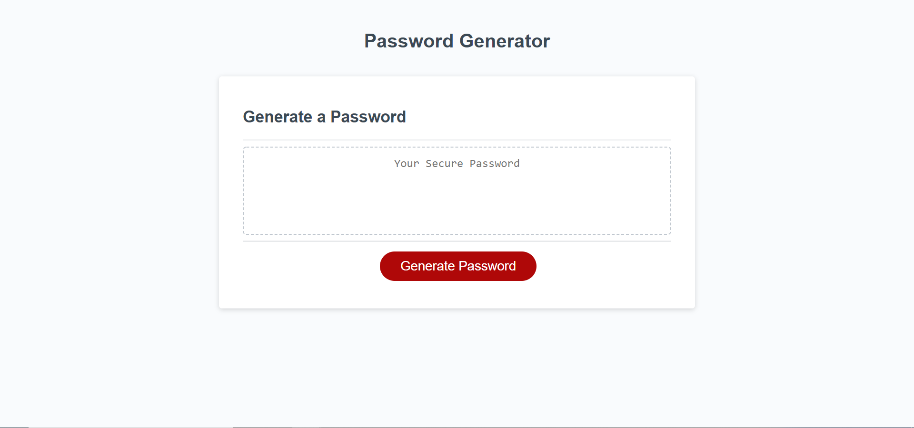

# Portfolio

## Purpose
Generate password of variable length that contains random characters of user selected types.

## Features
* Generate Password Button to get a password
* Series of prompts to determine desired password length and which types of characters should be in the password, chosen from lowercase letters, uppercase letters, numbers, and special symbols
* Password should have roughly equal amounts of each selected character type
* Password length can be from 8 to 128 characters long, and invalid inputs will prompt you again for a valid input
* Most repeated sections of code have been split into their own functions to improve readability and line count

## Built with
* HTML
* CSS
* JavaScript

## Website 
https://matt11711.github.io/passwordGenerator/

## Contribution
Made with ❤️ by Matt11711